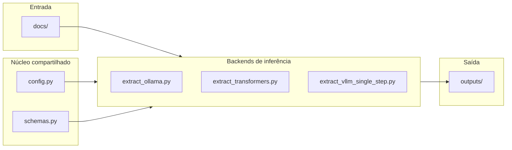

# POC — Extração de Documentos com Qwen2.5-VL

Prova de conceito para os 3 casos de uso (CNH, documento extenso, fatura de energia), usando **Qwen2.5-VL** como substituto do pipeline de 2 etapas (extração + formatação) em uma única inferência.

---

## O desafio

A API de extração de documentos do produto utiliza hoje um LLM em **duas etapas**:

1. **Interpretação e extração**: o modelo lê o documento e devolve texto livre.
2. **Formatação**: um segundo completion converte esse texto no schema JSON esperado pelo cliente.

Esse desenho gera problemas concretos:


| Problema                | Impacto                                                           |
| ----------------------- | ----------------------------------------------------------------- |
| **Latência**            | Duas inferências por documento dobram o tempo de resposta         |
| **Custo**               | Modelos de ponta cobrados por chamada em cada etapa               |
| **Layouts complexos**   | Tabelas aninhadas, formulários densos e múltiplos blocos de texto |
| **Documentos extensos** | PDFs com muitas páginas estouram limites de contexto              |
| **Gráficos e imagens**  | Interpretação limitada de conteúdo não-textual                    |


A POC deve processar **3 casos de uso distintos**:


| Caso                  | Documento                               | Objetivo                                                      |
| --------------------- | --------------------------------------- | ------------------------------------------------------------- |
| **CNH**               | `docs/Documento 1.jpeg`                 | Extrair campos estruturados (nome, CPF, datas, filiação)      |
| **Documento extenso** | `docs/Documento 3.pdf` (paper Claude 3) | Transcrever mantendo layout, tabelas e descrição de figuras   |
| **Fatura de energia** | `docs/Documento 2.jpg`                  | Extrair dados da fatura preservando associação rótulo ↔ valor |


---


## A proposta

Substituir o pipeline de 2 etapas por **uma única chamada** ao Qwen2.5-VL, guiando a decodificação com o schema JSON desejado:

```
ANTES (pipeline atual, 2 chamadas de LLM):
  Documento -> [LLM #1: ler e extrair em texto livre]
            -> [LLM #2: formatar texto em JSON]   <- 2ª chamada = 2× latência/custo

DEPOIS (proposto, 1 chamada):
  Documento -> [Qwen2.5-VL + guided decoding] -> JSON já validado
```

O **guided decoding** restringe a amostragem de tokens à gramática do schema — o modelo não pode gerar JSON inválido. Isso elimina a etapa de formatação por completo, em vez de só acelerá-la.


| Backend          | Mecanismo de guided decoding                                    |
| ---------------- | --------------------------------------------------------------- |
| **Ollama**       | parâmetro `format` com o JSON Schema                            |
| **vLLM**         | parâmetro `guided_json` (xgrammar)                              |
| **transformers** | schema apenas no prompt (sem guided nativo; fallback com regex) |


### Por que Qwen2.5-VL?

- **Aberto e auto-hospedável** (licença Qwen/Apache 2.0) → resolve o problema de *custo* por chamada de modelos proprietários de ponta.
- **Document parsing nativo**: treinado para extrair texto, tabelas, gráficos e formulários preservando layout, com suporte a saída estruturada.
- **Benchmarks públicos próximos do estado da arte**:
  - DocVQA: Qwen2.5-VL-7B ≈ 95,7% / Qwen2.5-VL-72B ≈ 96,4% (top do leaderboard, acima até de GPT-4o em pontuação bruta).
  - Benchmark independente da OmniAI (1.000 documentos, extração para JSON): Qwen2.5-VL-72B/32B ficaram em ~75% de acurácia — equivalente ao GPT-4o e **acima** do mistral-ocr (72,2%).
  - olmOCR-Bench: modelos da família Qwen2-VL/Qwen2.5-VL são a base de vários OCR especialistas open-source recentes (ex: olmOCR).

---


## Como o código está estruturado

A POC é um conjunto de scripts Python com **lógica de extração compartilhada** e **três backends** de inferência.




### Arquivos principais


| Arquivo                                                      | Responsabilidade                                                                                                                                                |
| ------------------------------------------------------------ | --------------------------------------------------------------------------------------------------------------------------------------------------------------- |
| `[config.py](config.py)`                                     | Paths (`docs/`, `outputs/`), presets de hardware (`lower`, `higher`), `RuntimeConfig` e argumentos CLI comuns (`--preset`, `--model`, `--quant`, `--max-pages`) |
| `[schemas.py](schemas.py)`                                   | JSON Schemas de CNH e Fatura de energia — usados para guided decoding e instrução ao modelo                                                                     |
| `[extract_ollama.py](extract_ollama.py)`                     | Extração via Ollama (`qwen2.5vl:3b` ou `7b`); `format` do schema garante JSON válido                                                                            |
| `[extract_transformers.py](extract_transformers.py)`         | Extração via Hugging Face `transformers`; suporta 4-bit (bitsandbytes) e AWQ                                                                                    |
| `[extract_vllm_single_step.py](extract_vllm_single_step.py)` | Cliente HTTP do servidor vLLM; usa `guided_json` para CNH e fatura                                                                                              |
| `[run_all.py](run_all.py)`                                   | Executa os 3 casos via transformers e salva em `outputs/`                                                                                                       |
| `[run_all_ollama.py](run_all_ollama.py)`                     | Executa os 3 casos via Ollama e salva em `outputs/`                                                                                                             |


### Funções de extração (comuns aos backends)

Cada backend implementa as mesmas três funções:


| Função                    | Caso              | Entrada default         | Saída                          |
| ------------------------- | ----------------- | ----------------------- | ------------------------------ |
| `extract_cnh()`           | CNH               | `docs/Documento 1.jpeg` | `outputs/cnh.json`             |
| `extract_long_document()` | Documento extenso | `docs/Documento 3.pdf`  | `outputs/documento_extenso.md` |
| `extract_invoice()`       | Fatura            | `docs/Documento 2.jpg`  | `outputs/fatura.json`          |


**Documentos extensos** são processados **página a página** (PDF convertido via `pdf2image` + Poppler) para não estourar tokens visuais. 

**Presets de hardware** (`config.py`):


| Preset   | Modelo                     | Quantização        | Uso típico                   |
| -------- | -------------------------- | ------------------ | ---------------------------- |
| `lower`  | Qwen2.5-VL-3B-Instruct     | 4-bit (~6 GB VRAM) | GPU consumer / máquina local |
| `higher` | Qwen2.5-VL-7B-Instruct-AWQ | AWQ                | GPU consumer / L4 (~6–8 GB); cabe no Colab T4 16 GB |


---


## Os 3 casos de uso


### Caso 1 — CNH (documento estruturado)

Extrai campos predeterminados da Carteira Nacional de Habilitação.

**Schema** (`schemas.py` → `CNH_SCHEMA`):

```json
{
  "nome": "...",
  "cpf": "000.000.000-00",
  "data_nascimento": "DD/MM/AAAA",
  "data_emissao": "DD/MM/AAAA",
  "filiacao_pai": "...",
  "filiacao_mae": "..."
}
```

**Exemplo de saída** (`outputs/cnh.json`):

```json
{
  "nome": "Lince da Silva",
  "cpf": "891.340.611-75",
  "data_nascimento": "02/05/2017",
  "data_emissao": "22/10/2013",
  "filiacao_pai": "José da Silva",
  "filiacao_mae": "Maria da Silva"
}
```


### Caso 2 — Documento extenso (paper Claude 3)

Transcreve o PDF mantendo organização do layout em Markdown: títulos, parágrafos, tabelas e descrição objetiva de figuras/gráficos.

**Saída**: `outputs/documento_extenso.md` — Markdown com marcadores `<!-- página N -->` entre páginas.

### Caso 3 — Fatura de energia (layout complexo)

Extrai dados da fatura preservando a associação entre rótulos e valores em blocos/colunas separados.

**Schema** (`schemas.py` → `FATURA_ENERGIA_SCHEMA`): titular, número do cliente, datas, valor total, consumo, histórico de consumo (array), componentes de cobrança (array), tributos (array).

**Exemplo de saída** (`outputs/fatura.json`):

```json
{
  "titular": "MARIA JOSÉ DA SILVA",
  "numero_cliente": "1234567890",
  "mes_referencia": "06/2014",
  "data_vencimento": "10/07/2014",
  "valor_total": "63,72",
  "consumo_kwh": "160.0000000",
  ...
}
```

---


## Como rodar


### Pré-requisitos

- **Python 3.10+**
- **Poppler** (conversão de PDF → imagem):
  - Windows: [poppler-windows](https://github.com/oschwartz10612/poppler-windows/releases) — adicione ao `PATH`
- **GPU** recomendada para transformers e vLLM; Ollama roda em CPU (mais lento) ou GPU

Os scripts usam os documentos em `docs/` por padrão quando o caminho do arquivo não é passado (`DEFAULT_DOCS` em `config.py`).

---


### Caminho A — Ollama

Não exige download do Hugging Face nem torch. O Ollama baixa o modelo quantizado (~3 GB no 3B) e roda localmente.

**1. Instale o app Ollama:** [https://ollama.com](https://ollama.com)

**2. Baixe o modelo de visão:**

```bash
ollama pull qwen2.5vl:3b    # ~3 GB, recomendado
ollama pull qwen2.5vl:7b    # ~6 GB, mais preciso
```

**3. Instale dependências Python:**

```bash
pip install -r requirements/requirements-ollama.txt
```

**4. Execute os 3 casos de uma vez:**

```bash
python run_all_ollama.py
python run_all_ollama.py --model qwen2.5vl:7b
python run_all_ollama.py --max-pages 2          # longdoc: só 2 páginas
python run_all_ollama.py --only cnh --only fatura
```

**5. Ou execute um caso individual:**

Cada execução salva automaticamente em `outputs/` e também imprime no terminal.

```bash
python extract_ollama.py cnh
python extract_ollama.py fatura
python extract_ollama.py fatura --model qwen2.5vl:7b
python extract_ollama.py longdoc
python extract_ollama.py longdoc --max-pages 2
python extract_ollama.py fatura --out outro/caminho.json   # caminho alternativo
```

---


### Caminho B — transformers (Hugging Face, GPU / Colab)

Carrega o modelo diretamente via `transformers`. Ideal para Colab ou máquina com GPU.

**1. Instale dependências:**

```bash
pip install -r requirements/requirements-local.txt
```

**2. Execute os 3 casos:**

```bash
python run_all.py --preset lower              # 3B 4-bit (~6 GB VRAM)
python run_all.py --preset higher             # 7B-AWQ (T4 16 GB)
python run_all.py --max-pages 2
python run_all.py --only longdoc
```

**3. Ou execute um caso individual:**

Cada execução salva automaticamente em `outputs/` e também imprime no terminal.

```bash
python extract_transformers.py cnh
python extract_transformers.py fatura
python extract_transformers.py longdoc
python extract_transformers.py longdoc --max-pages 2
python extract_transformers.py cnh --model Qwen/Qwen2.5-VL-3B-Instruct --quant 4bit
python extract_transformers.py fatura --out outro/caminho.json   # caminho alternativo
```

---


### Caminho C — vLLM + guided_json (arquitetura recomendada no Dossiê)

Demonstra a arquitetura de 1 passo com **guided decoding nativo** via vLLM. Requer Linux com GPU.

**1. No servidor (GPU):**

```bash
pip install -r requirements/requirements-vllm.txt

vllm serve Qwen/Qwen2.5-VL-7B-Instruct-AWQ \
    --port 8000 --host 0.0.0.0 \
    --quantization awq --dtype float16 \
    --limit-mm-per-prompt image=1
```

**2. No cliente (outra janela ou máquina):**

Cada execução salva automaticamente em `outputs/` e também imprime no terminal.

```bash
pip install requests pdf2image pillow

python extract_vllm_single_step.py cnh
python extract_vllm_single_step.py fatura
python extract_vllm_single_step.py longdoc
python extract_vllm_single_step.py longdoc --max-pages 3
python extract_vllm_single_step.py fatura --out outro/caminho.json   # caminho alternativo
```

---


## Hardware e custo (estimativas)


| Configuração                       | VRAM aproximada     | Onde usar                   |
| ---------------------------------- | ------------------- | --------------------------- |
| Qwen2.5-VL-3B-Instruct (4-bit)     | ~6 GB               | Máquina local / GPU consumer |
| Qwen2.5-VL-7B via Ollama (quant. interna)† | ~6 GB        | Máquina local (CPU ou GPU) — **usada na POC** |
| Qwen2.5-VL-7B-Instruct-AWQ (int4)  | ~6–8 GB             | GPU consumer / nuvem barata (L4) |
| Qwen2.5-VL-7B-Instruct (bf16)      | ~16–18 GB           | GPU única (RTX 4090 / A10)  |
| Qwen2.5-VL-72B-Instruct-AWQ (int4) | ~40–48 GB           | 1× A100/H100 80 GB          |
| Qwen2.5-VL-72B-Instruct (bf16)     | ~145 GB (multi-GPU) | Cluster / cloud             |

† Variante efetivamente testada na POC (`qwen2.5vl:7b` via Ollama). Guided decoding via parâmetro `format` com JSON Schema.

Custo de nuvem (referência, varia por provedor/região): GPU H100 a partir de ~US$2,50/h on-demand, A100 80 GB a partir de ~US$1,30/h em provedores como RunPod.

**Custo por página (auto-hospedado, produção):** tomando uma GPU NVIDIA L4 a ~US$1,00/h *on-demand* e supondo, de forma conservadora, um *throughput* amortizado de ~5 s/página com *continuous batching* do vLLM (~720 páginas/h):

```
C_página ≈ US$1,00/h ÷ 720 pág./h ≈ US$0,0014/página (≈ US$1,40 por 1.000 páginas)
```

Esse valor é tipicamente **inferior** ao custo por página de APIs multimodais de fronteira (que cobram por *tokens* de entrada/saída em cada chamada e seriam pagas duas vezes no pipeline atual de 2 etapas). A vantagem do auto-hospedado cresce com a escala, dado o custo marginal próximo de zero.

---


## Limitações conhecidas

- Documentos muito degradados ou manuscritos tendem a ter queda de acurácia em todos os VLMs atuais 
- Para documentos *muito* longos (>30–40 páginas), processar página a página (como em `extract_long_document`) é mais robusto que mandar o PDF inteiro, mas custa mais chamadas — trade-off latência vs. completude.
- No backend **transformers**, o JSON é guiado apenas via prompt (sem guided decoding nativo); Ollama e vLLM garantem JSON válido via schema.

---


## Estrutura de arquivos

```
poc/
├── docs/
│   ├── Documento 1.jpeg           # CNH
│   ├── Documento 2.jpg            # Fatura de energia
│   └── Documento 3.pdf            # Paper Claude 3 (documento extenso)
├── outputs/
│   ├── cnh.json
│   ├── fatura.json
│   └── documento_extenso.md
├── requirements/
│   ├── requirements.txt           # aponta a requirements-local.txt
│   ├── requirements-local.txt     # transformers (Caminho B)
│   ├── requirements-ollama.txt    # Ollama (Caminho A)
│   └── requirements-vllm.txt      # vLLM servidor (Caminho C)
├── config.py                      # presets, paths e argumentos CLI
├── schemas.py                     # JSON Schemas (CNH e Fatura)
├── extract_ollama.py              # extração via Ollama
├── extract_transformers.py        # extração via Hugging Face
├── extract_vllm_single_step.py    # cliente vLLM (guided_json)
├── run_all_ollama.py              # executa os 3 casos (Ollama)
├── run_all.py                     # executa os 3 casos (transformers)
└── README.md
```

